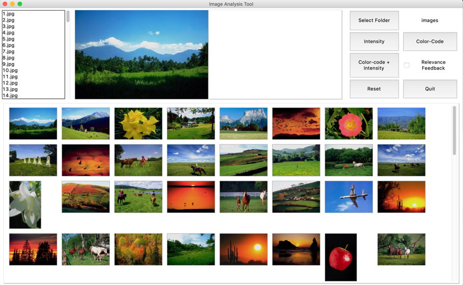
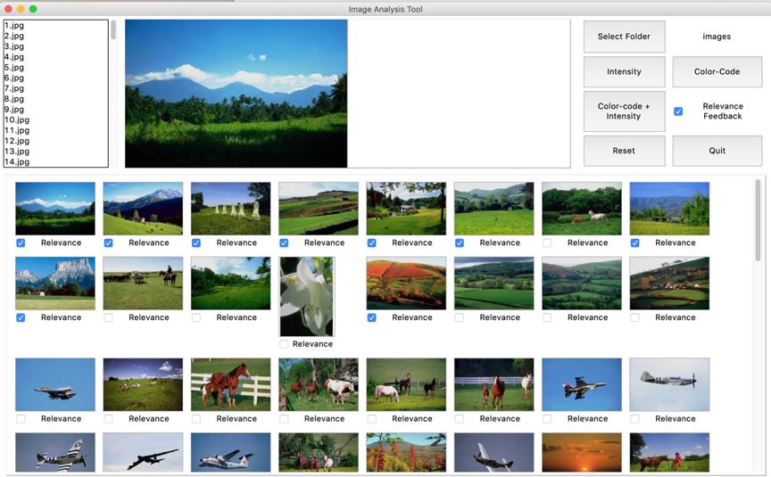
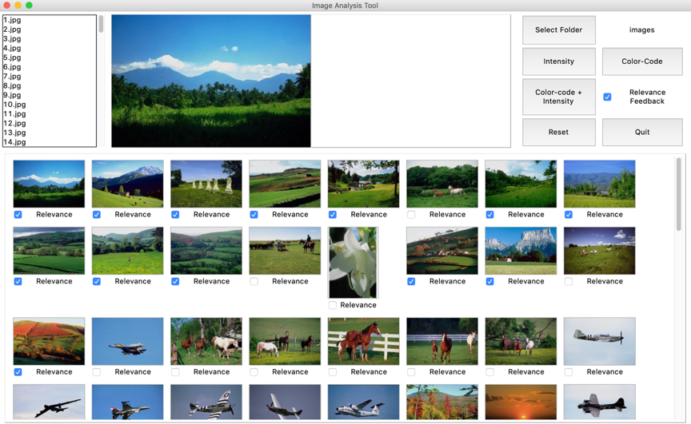
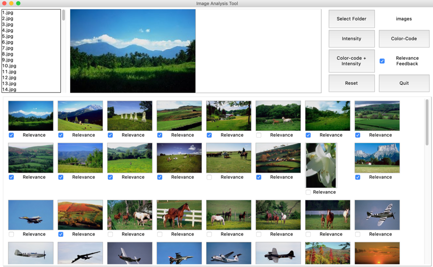
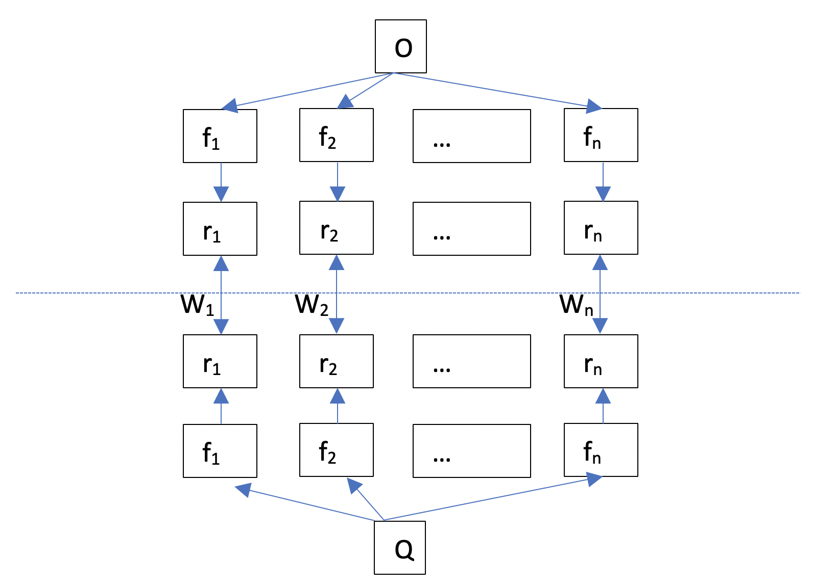

# Content-Based Image Retreval System with Relevance Feedback

### Yunbo Chen

## How to Run
1.	After decompressing the .zip file, go into the unzipped folder
2.	Put the desired images into the “images” folder.
3.	Make sure to have Python3 installed and also have `Pillow`, `numpy`, `scikit-learn` and `pandas` libraries installed.
4.	At the root of the unzipped folder, do `python3 ImageViewer.py`. Wait a few seconds (depending on the system configuration) for it to load up.

## How to Use The System

* The blue area is query image selection area. User can click on the filenames in the listbox and preview the query image. 
* The yellow area is result preview area. User can see the result of the query images at the bottom. By clicking on the images in the bottom yellow area, user can view a bigger preview of it on the top yellow area.
* The green area is options selection area. User can change the folder of the images database by clicking on “Select Folder” button. The resulting folder path will be shown to the right of the button. User can choose whether to query with intensity mode, color-code mode, or “color-code+intensity” mode. In the “color-code+intensity“ mode, user can choose whether to provide feedback on the result images or not by clicking on the “Relevance Feedback” checkbox. User can reset the previous relevance and result images order by clicking “Reset” button. User can quit the program by clicking on the “Quit” button.

## Sample User Story
To query an image, user first select the folder they put the images in by clicking on the “Select Folder” button. Afterwards, user may choose a query image in the top-left listbox. Then user may start the query with ‘intensity’, ‘color-code’ or ‘Color-code + Intensity’ options. If user chooses the ‘Color-code + Intensity’ options, user may also provide relevance feedback on the result images by clicking on “Relevance Feedback” checkbox. Then user can check the images that user thinks are relevant and do the search again by clicking on “Color-code + Intensity” button. User may provide feedback in as many iterations as user wants. User may reset the preference with ‘reset’ button or quit the program with ‘Quit’ button.

## DEMO - Retrieval Result on ‘image1.jpg’
### Color-code+Intensity without RF: 
  
We can see that out of the first 20 images, images that are very similar to the query image are No.1,2,4,5,8,9,13,14,18, since they are all green natural scenes with a part of blue sky. There are images with horses that are fairly similar to the query images, such as No.11,12,15,16,19. The remaining images are not relevant, such as No.3,6,7,10,17,20. I think the first two groups of images are considered true positives. Therefore, the precision in this case would be 14/20 = 0.7. But if we consider precision with the user-provided relevance feedback, in which case user checked 9 images that are relevant, then the precision would be 9/20=0.45.  

### Color-code+Intensity with RF, 1st iteration:
  
In this case, the images that are not at all relevant are No.11, 16,18,19,20, then the precision in this case is 15/20 = 0.75. But if we calculate precision using user’s feedback for next iteration, in which case user checked 13 images out of the first 20, the precision would be 13/20=0.65.

### Color-code+Intensity with RF, 2nd iteration:
  
In this case, the images that are not at all relevant are No.12, 18,19,20, then the precision in this case is 16/20 = 0.8. But if we calculate precision using user’s feedback for next iteration, in which case user checked 14 images out of the first 20, the precision would be 14/20=0.7.

### Color-code+Intensity with RF, 3rd iteration:

In this case, the images that are not at all relevant are No.14, 17, 19,20, then the precision in this case is 16/20 = 0.8. But if we calculate precision using user’s feedback, in which case user checked 14 images out of the first 20, the precision would be 14/20=0.7.

## Paper Discussion
The image recommendation algorithm is based on work of Rui et al. [1].  
Our revised algorithm for relevance feedback:  

In our retrieval process, we also have the feature vectors aggregated as a feature matrix. In doing so, we calculate the normalized feature matrices of intensity features and color-code features separately before concatenating them together. In the ‘Q’ part, which is the query part of our revised algorithm, we use the feature matrix of the selected query image in the non-RF stage, and then use the feature matrix vertically concatenated by relevant images selected by user in the RF stage.  

Then for the “representation” section of [Rui98]’s implementation, in which the algorithm uses multiple presentation vectors rij to describe each feature, our revised algorithm makes the representation matrix in the same dimension as the feature matrix, thereby saving a lot of computation expense. Both our algorithm and [Rui98] utilize the main idea of sending the user’s relevance feedback back to Q, by updating the weight matrix(matrices).  

The biggest difference, in my opinion, is on the weight matrices. In the algorithm of [Rui98], there are 3 weight vectors, distributing the weights of each layer of the algorithm. And the weights are inter-related regarding finding the similarities: The intra-similarity is first calculated with the intra-weights and a similarity measurement such as Manhattan distance. Then we can calculate the inter-similarity, which is the connection from ri to fi, using the inter-weight. Finally, we can have the overall similarity using the previous inter-similarity and the Wi. However, in our revised algorithm, we have only one weight matrix calculated using the variance of relevant image feature matrix.   

In terms of updating weights, the inter-weight is first updated using the relevance feedback from the user. Since in [Rui98] user can provide more detailed feedback in the domain of [3,1,0,-1,-3], we can have the weight more precisely to user’s preference. Then we can add user’s score into the weight with a conditional function and update the inter-weight. Intra-weight matrix is updated in the same manner as our revised algorithm. It is updated by using the standard deviation , do 1/. The normalizations during these steps are very important since it can prevent the vectors from being in different magnitude and becoming incomparable.   

The features used in [Rui98]’s algorithm are also different from that of our revised algorithm. [Rui98]’s algorithm uses texture and shape as input features beside basic RGB values, whereas our algorithm uses intensity and color-code method. In the representation vectors of each feature in [Rui98]’s algorithm, it contains even more methods describing the image’s attributes, such as color moments, co-occurrence matrix, etc., whereas our revised algorithm only used histograms to directly output the features.

## Reference
[1] Rui, Yong, et al. "Relevance feedback: a power tool for interactive content-based image retrieval." IEEE Transactions on circuits and systems for video technology 8.5 (1998): 644-655.
